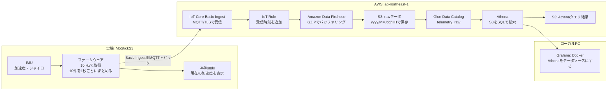
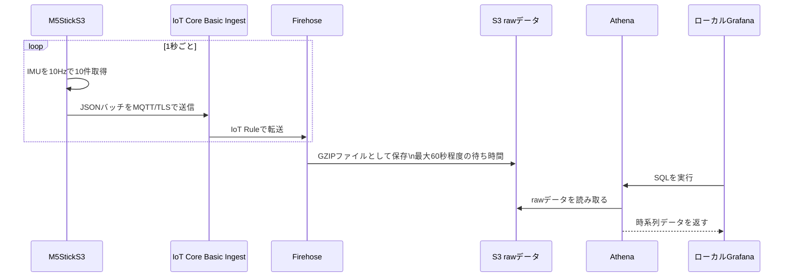

# 構成とデータの流れ

このプロジェクトは、M5StickS3で取得したIMU（加速度・ジャイロ）データをAWSへ保存し、あとからローカルGrafanaで確認するための構成です。

リアルタイムの制御や判定は目的にしていません。実機はデータを収集して送信し、AWSは保存、AthenaとGrafanaは後からの検索・可視化を担当します。

## 全体構成



## 実機から可視化まで



## 各部分の役割

| 部分 | 役割 | 常時動作するもの |
| --- | --- | --- |
| M5StickS3 | センサー取得、加速度・電池残量の画面表示、MQTT/TLS送信 | バッテリー残量とWi-Fi接続がある間だけ動作 |
| IoT Core Basic Ingest / IoT Rule | 実機の送信を受け、Firehoseへ渡す | AWS管理サービス |
| Firehose / S3 | バッチ化して圧縮保存する | AWS管理サービス |
| Glue / Athena | S3上のデータをSQLで検索する | Athenaのクエリ実行時 |
| Grafana | Athenaの結果をグラフとして表示する | Mac上のDockerが起動している間 |

## 送信内容と保存形式

- 実機は10 HzでIMUを取得し、10件をまとめて約1秒ごとに送信します。
- 送信先は次のBasic Ingestトピックです。

  ```text
  $aws/rules/training_iot_basic_ingest/training/{deviceId}/telemetry
  ```

- 送信データのJSON形式は [telemetry-schema.md](telemetry-schema.md) を参照してください。
- FirehoseはデータをGZIP圧縮し、S3の `raw/yyyy/MM/dd/HH/` に保存します。
- `datehour` を指定してAthenaを検索すると、必要な時間帯のファイルだけを対象にできます。

## AWSとローカルPCの境界

AWS側のIoT Core、Firehose、S3、Glueは、スタックをデプロイした後にMacを閉じても動き続けます。実機がWi-Fi経由で送信していれば、データ保存は続きます。

一方、GrafanaはローカルDockerです。MacまたはGrafanaコンテナを停止すると画面は開けませんが、AWSへの保存処理には影響しません。再開時は、短期AWS認証情報を更新してから `./tools/start-grafana.sh` を実行します。詳しい操作は [operations.md](operations.md) を参照してください。

## この構成でできること・しないこと

できること:

- 実機の加速度・ジャイロを低コストで継続保存する。
- 日時・デバイス・セッションを指定してAthenaで検索する。
- Grafanaで過去の運動データを時系列グラフとして見る。

初期構成で扱わないこと:

- IoT CoreのPub/Subを使ったデバイスへの即時指示。
- 数秒以内の表示を保証するリアルタイム監視。Firehoseのバッファリング後にS3へ保存されるため、Grafanaで見えるまで最大約1分かかります。
- クラウド上での運動フォームの即時判定。
